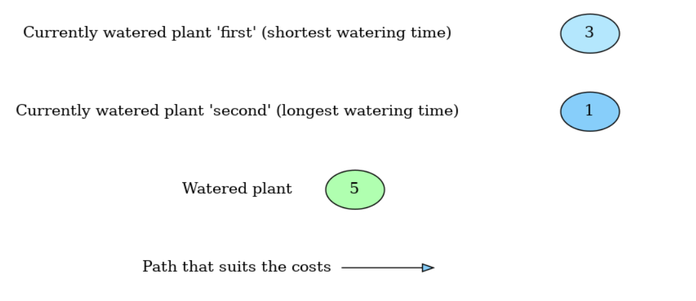

[English version](#English-version)

[Polish version](#Polish-version)

## English version

  <h1>Greenhouse-Optimization</h1>
  
A project showing the operation of optimization algorithms using the example of a greenhouse

  
2024-12-18

 

# Description of the problem
There is a set number of rows in the greenhouse (a set number of beds in each row). Plants require watering, water is circulating (the water flows in one direction all the time). The program is designed to determine the order of watering 2 plants at the same time for one watering cycle, assuming that we choose one plant for the shortest watering time and the other for the longest time. The distance of plants watered at a given moment is equal to the cost of keeping the valves open.

To determine the watering time, use the formula:

  <h2>$T = \frac{W \cdot S}{Q}$</h2>

 

where:
  * $T$ -watering time (in seconds)
  * $W$ - water demand (in liters per $m^2$)
  * $S$ - size of a single bed (in $m^2$)
  * $Q$ - water flow (litres per second)

  <h2>$Q = \frac{k \cdot P}{60}$</h2>

 

where:
  * $k$ - coefficient depending on the hose diameter
  * $P$ - pressure in bars

The formula for the $k$ coefficient can be written in a simplified version:

  <h2>$k = d - 4$</h2>

 

where:
  * $d$ - hose diameter in millimeters (minimum 5mm)

The constants adopted in the program:
  * $S=0.25m^2$
  * $P=6B$
  * $d=5mm$

# List of algorithms used

|  | Algorithm           | Complexity          |
|-----|--------------------|--------------------|
| 1.  | Greedy algorithm | n³                |
| 2.  | Ant Colony Optimisation  | n⁴                |
| 3.  | Brute Force    | n! ⋅ n log n      |

# Solution visualization
A step-by-step example solution for a 3-row greenhouse, with 4 beds in each. Randomly selected plant locations in the greenhouse:

| Bed number | Name of the plant         | Watering time [s] |
|--------------|----------------------|--------------------|
| 0           | Lettuce                | 10                 |
| 1           | Tomato               | 20                 |
| 2           | Onion                | 10                 |
| 3           | Parsley    | 8                  |
| 4           | Cucumber                | 18                 |
| 5           | Spinach               | 13                 |
| 6           | Red beet        | 10                 |
| 7           | Dill               | 10                 |
| 8           | Basil               | 10                 |
| 9           | Arugula               | 10                 |
| 10          | Pepper               | 15                 |
| 11          | Carrot               | 13                 |

----------------------------------------------------------------------------------------------------------

----------------------------------------------------------------------------------------------------------

-----------------------------------------------------------------------------

-----------------------------------------------------------------------

------------------------------------------------------------------------

--------------------------------------------------------------------------

----------------------------------------------------------------------

# Greedy algorithm 
The greedy algorithm works by minimizing the total cost of a single operation, while meeting the requirement that plants are watered in the correct order. First, auxiliary variables are initialized: `first_index` and `second_index` (indicators of plants that will be watered in a given round, initially set to -1). The main loop executes until all plants are watered. In each iteration, the algorithm selects two plants to water: one with the shortest watering time (`first_index`) and one with the longest watering time (`second_index`).

If `second_index` is set to -1, the algorithm searches all plants that have not been watered yet and selects the one with the longest watering time. Then, from among these plants, it selects the one that has the lowest operation cost relative to the already selected first plant. If `first_index` is set to -1, the algorithm makes a similar selection, but for the plant with the shortest watering time.

After selecting two plants, the algorithm calculates the total watering time and the cost of the operation. Depending on which plant has a shorter watering time, both plants are watered. When the watering time of both plants is equal, both plants finish watering at the same time. If the watering time of one plant is shorter, the plant with the shorter time finishes watering, and the other plant continues watering until it finishes.

The loop ends when all the plants are watered, and at the end, the algorithm makes a final watering of the plant that is left, if any.

Computational complexity of the algorithm:

  <h2>$O(n^3)$</h2>

 

where $n$=`numbers_beds` i.e. the number of beds

# Ant Colony Optimisation
The algorithm uses an ant colony optimization approach to optimize the order of watering plants. The goal is to find a route with minimal cost of crossing between beds, while meeting the watering time requirements.

First, the algorithm initializes the `heuristic` (inverse of the cost of crossing between beds) and `pheromones` (pheromone trails) arrays, which are initially equal to 1. Then, each "ant" (iteration) generates a route through all plants, selecting subsequent beds based on a combination of heuristic information and pheromone level. The selection process is probabilistic - the higher the product of pheromones and heuristics, the higher the chance of selecting a given bed.

In each iteration, the ant analyzes two plants: one with the longest watering time and the other with the shortest. If more than one possible bed is available, the selection is based on the probability calculated from pheromones and heuristics. After the route is completed, the algorithm calculates its total cost and time. The results are saved, and if the costs do not improve over subsequent iterations, the algorithm stops the previous ones and returns the route with the lowest cost.

Finally, the algorithm returns the shortest route found, which corresponds to the optimal solution of the plant watering problem within the given heuristics and pheromone updates.

Computational complexity:

  <h2>$O(n^4)$</h2>

 

where $n$=`numbers_beds` i.e. the number of beds

# Brute Force
The brute_force_algorithm algorithm performs an exhaustive search to find the optimal way to water plants distributed across beds. It starts by checking how many plants are left to be watered by counting the number of elements in the `used_plants` vector that have not yet been marked as watered. If all plants have been watered, the algorithm compares the total cost of the current path to the best cost found so far, stored in the `brute_cost` variable. If the new cost is lower, the global `brute_cost` and `brute_result` scores are updated. If there is one plant left to be watered, the algorithm adds its watering time to the total time, updates the score, marks that plant as watered, and exits for that path.

Otherwise, if more than one plant is left to be watered, the algorithm sorts them by watering time, grouping plants with the same time together. Then, for each combination of two plants from the extreme groups (with the longest and shortest watering times), it tries to water them simultaneously. For the selected pair of plants, the algorithm calculates the minimum time needed to finish watering one of them and updates the watering times of the remaining plants. Then, it updates the total cost by adding the cost of moving between the two plants, and marks them as watered accordingly.

If one of the plants from the pair has been fully watered, the algorithm continues watering from the other plant. If both have been fully watered, the algorithm returns to the state in which no specific plant is currently being watered and searches for further possible routes. The algorithm recursively generates all possible paths, trying every possible combination of plant choices until all are watered. Finally, it returns the route with the lowest cost among all tested ones.

Thanks to this, the algorithm finds an exact solution to the problem, at the cost of high computational complexity resulting from the need to consider every possible combination of the order of watering the plants.

Computational complexity:

  <h2>$O(n! \cdot n logn)$</h2>

 

where $n$=`numbers_beds` i.e. the number of beds

# Summary 

In the case of the plant watering problem, three different algorithms offer different approaches and time efficiency, depending on their characteristics.

The brute force algorithm analyzes all possible plant watering orders to find a globally optimal solution. In each combination, it considers the cost and time of watering, which allows it to find the best result. However, the algorithm has the longest running time because the computational complexity grows exponentially with the number of beds, making it impractical for large problems.

The greedy algorithm runs fast, selecting a pair of plants at each iteration that locally minimizes the cost or time of watering. In the case of the plant watering problem, this algorithm can choose the plants with the shortest or longest watering time and optimize their joint watering. Although this algorithm has the shortest running time compared to the others, the result may not be globally optimal because the local approach ignores future opportunities for improvement.

The ant algorithm simulates the behavior of an ant colony to find efficient watering routes for plants. Each “ant” represents a possible solution, and good routes are reinforced with pheromones, which direct the search of other ants. This algorithm is flexible and works well in practice when you need to find solutions that are close to optimal in a reasonable amount of time. Its running time is intermediate: it takes longer than the greedy one, but shorter than the brute force one, because instead of analyzing all possibilities, it focuses on those that are promising.

To summarize, the greedy algorithm is the fastest but does not guarantee an optimal solution, the brute force algorithm provides an optimal result but takes the longest, and the ant algorithm is a compromise between running time and the quality of the results. The choice of the best algorithm depends on the size of the problem and the requirements for accuracy and computation time.

A graph showing the dependence of the running time of the individual algorithms on the number of plants in the greenhouse:

## Polish version

  <h1>Szklarnia-Optymalizacja</h1>
  
Projekt pokazujący działanie algorytmów optymalizacyjnych na przykładzie szklarni

  
2024-12-18

 

# Opis problemu
W szklarni znajduje się zadana liczba rzędów (w każdym rzędzie określona liczba grządek). Rośliny wymagają podlewania, woda jest w obiegu (prąd wody idzie cały czas w jedną stronę). Program ma za zadanie wyznaczyć kolejność podlewania 2 roślin jednocześnie dla jednego cyklu podlewania, przy założeniu, że jedną roślinę wybieramy przez najkrótszy czas podlewania, a drugą przez najdłuższy czas. Odległość podlewanych w danym momencie roślin jest równa kosztowi utrzymania otwartych zaworów. 

Aby wyznaczyć czas podlewania należy skorzystać ze wzoru:

  <h2>$T = \frac{W \cdot S}{Q}$</h2>

 

gdzie:
  * $T$ - czas podlewania (w sekundach)
  * $W$ - zapotrzebowanie na wodę (w litrach na $m^2$)
  * $S$ - wielkość pojedynczej grządki (w $m^2$)
  * $Q$ - przepływ wody (w litrach na sekundę)

  <h2>$Q = \frac{k \cdot P}{60}$</h2>

 

gdzie:
  * $k$ - współczynnik zależny od średnicy węża
  * $P$ - ciśnienie w barach

Wzór na współczynnik $k$ można zapisać w uproszczonej wersji:

  <h2>$k = d - 4$</h2>

 

gdzie:
  * $d$ - średnica węża w milimetrach (minimum 5mm)

Przyjęte w programie stałe:
  * $S=0.25m^2$
  * $P=6B$
  * $d=5mm$

# Spis zastosowanych algorytmów 

| Lp. | Algorytm           | Złożoność          |
|-----|--------------------|--------------------|
| 1.  | Algorytm zachłanny | n³                |
| 2.  | Algorytm mrówkowy  | n⁴                |
| 3.  | Algorytm siłowy    | n! ⋅ n log n      |

# Wizualizacja rozwiązania
Przykładowe rozwiązanie krok po kroku dla szklarni 3 rzędowej, po 4 grządki w każdym. Wylosowane umiejscowienie roślin we szklarni:

| Numer grządki | Nazwa rośliny         | Czas podlewania [s] |
|--------------|----------------------|--------------------|
| 0           | Sałata                | 10                 |
| 1           | Pomidor               | 20                 |
| 2           | Cebula                | 10                 |
| 3           | Pietruszka naciowa    | 8                  |
| 4           | Ogórek                | 18                 |
| 5           | Szpinak               | 13                 |
| 6           | Burak ćwikłowy        | 10                 |
| 7           | Koperek               | 10                 |
| 8           | Bazylia               | 10                 |
| 9           | Rukola                | 10                 |
| 10          | Papryka               | 15                 |
| 11          | Marchew               | 13                 |

----------------------------------------------------------------------------------------------------------

----------------------------------------------------------------------------------------------------------

-----------------------------------------------------------------------------

-----------------------------------------------------------------------

------------------------------------------------------------------------

--------------------------------------------------------------------------

----------------------------------------------------------------------

# Algorytm zachłanny 
Algorytm zachłanny działa minimalizując całkowity koszt pojedynczej operacji, przy spełnieniu wymagania, aby rośliny były podlewane w odpowiednich kolejnościach. Na początku inicjalizowane są zmienne pomocnicze: `first_index` i `second_index` (wskaźniki roślin, które będą podlewane w danej turze, początkowo ustawione na -1). Pętla główna wykonuje się do momentu, kiedy wszystkie rośliny zostaną podlane. W każdej iteracji algorytm wybiera dwie rośliny do podlania: jedną o najkrótszym czasie podlewania (`first_index`) i jedną o najdłuższym czasie podlewania (`second_index`).

Jeśli `second_index` jest ustawiony na -1, algorytm przeszukuje wszystkie rośliny, które jeszcze nie zostały podlane, i wybiera tę, która ma najdłuższy czas podlewania. Następnie spośród tych roślin wybiera tę, która ma najmniejszy koszt operacji względem już wybranej pierwszej rośliny. Jeśli `first_index` jest ustawiony na -1, algorytm dokonuje podobnego wyboru, ale dla rośliny o najkrótszym czasie podlewania.

Po wybraniu dwóch roślin, algorytm oblicza całkowity czas podlewania i koszt operacji. W zależności od tego, która roślina ma krótszy czas podlewania, obie rośliny są podlewane. Gdy czas podlewania obu roślin jest równy, obie kończą podlewane jednocześnie. Jeśli czas podlewania jednej rośliny jest krótszy, kończy się podlewanie rośliny z mniejszym czasem, a druga roślina kontynuuje podlewanie aż do zakończenia.

Pętla kończy się, gdy wszystkie rośliny zostaną podlane, a na końcu algorytm dokonuje ostatecznego podlewania rośliny, która pozostała, jeśli taka istnieje.

Złożoność obliczeniowa algorytmu:

  <h2>$O(n^3)$</h2>

 

gdzie $n$=`numbers_beds` czyli liczba grządek

# Algorytm mrówkowy
Algorytm wykorzystuje podejście inspirowane kolonią mrówek (ant colony optimization) do optymalizacji kolejności podlewania roślin. Celem jest znalezienie trasy o minimalnym koszcie przejść między grządkami, przy jednoczesnym spełnieniu wymagań czasów podlewania.

Na początku algorytm inicjalizuje tablice `heuristic` (odwrotność kosztów przejść między grządkami) oraz `pheromones` (śladów feromonowych), które początkowo są równe 1. Następnie każda "mrówka" (iteracja) generuje trasę przez wszystkie rośliny, wybierając kolejne grządki na podstawie kombinacji informacji heurystycznej i poziomu feromonów. Proces wyboru jest probabilistyczny – im wyższy produkt feromonów i heurystyki, tym większa szansa na wybór danej grządki.

W każdej iteracji mrówka analizuje dwie rośliny: jedną o najdłuższym czasie podlewania i drugą o najkrótszym. Jeśli dostępnych jest więcej niż jedna możliwa grządka, wybór następuje na podstawie prawdopodobieństwa wyliczonego z feromonów i heurystyki. Po zakończeniu trasy algorytm oblicza jej całkowity koszt i czas. Wyniki są zapisywane, a jeśli przez kolejne iteracje koszty nie ulegają poprawie, algorytm przerywa wcześniejsze i zwraca trasę o najniższym koszcie.

Ostatecznie algorytm zwraca najkrótszą znalezioną trasę, co odpowiada optymalnemu rozwiązaniu problemu podlewania roślin w ramach zadanej heurystyki i aktualizacji feromonów.

Złożoność obliczeniowa:

  <h2>$O(n^4)$</h2>

 

gdzie $n=$`numbers_beds` czyli liczba grządek

# Algorytm siłowy
Algorytm brute_force_algorithm realizuje wyczerpujące przeszukiwanie w celu znalezienia optymalnego sposobu podlewania roślin rozmieszczonych na grządkach. Rozpoczyna od sprawdzenia, ile roślin pozostało do podlania, poprzez zliczenie elementów w wektorze `used_plants`, które jeszcze nie zostały oznaczone jako podlane. Jeśli wszystkie rośliny zostały podlane, algorytm porównuje całkowity koszt bieżącej trasy z najlepszym dotychczas znalezionym kosztem zapisanym w zmiennej `brute_cost`. Jeśli nowy koszt jest mniejszy, aktualizowane są globalne wyniki `brute_cost` i `brute_result`. Jeśli pozostała jedna roślina do podlania, algorytm dodaje jej czas podlewania do całkowitego czasu, aktualizuje wynik i oznacza tę roślinę jako podlaną, po czym kończy działanie dla tej ścieżki.

W przeciwnym razie, gdy więcej niż jedna roślina pozostaje do podlania, algorytm sortuje je według czasu podlewania, grupując rośliny o takim samym czasie. Następnie dla każdej kombinacji dwóch roślin z grup skrajnych (o najdłuższym i najkrótszym czasie podlewania) próbuje je podlać równocześnie. Dla wybranej pary roślin algorytm oblicza minimalny czas potrzebny na zakończenie podlewania jednej z nich oraz aktualizuje czasy podlewania pozostałych roślin. Następnie aktualizuje całkowity koszt, dodając koszt przejścia między dwoma roślinami, i odpowiednio oznacza je jako podlane.

Jeśli jedna z roślin z danej pary została w pełni podlana, algorytm kontynuuje podlewanie od drugiej rośliny. Jeśli obie zostały w pełni podlane, algorytm wraca do stanu, w którym żadna konkretna roślina nie jest aktualnie podlewana, i przeszukuje dalsze możliwe trasy. Algorytm rekurencyjnie generuje wszystkie możliwe ścieżki, próbując każdą możliwą kombinację wyborów kolejnych roślin, aż wszystkie zostaną podlane. Ostatecznie zwraca trasę z najniższym kosztem spośród wszystkich przetestowanych.

Dzięki temu algorytm znajduje dokładne rozwiązanie problemu, kosztem wysokiej złożoności obliczeniowej, wynikającej z konieczności rozważenia każdej możliwej kombinacji kolejności podlewania roślin.

Złożoność obliczeniowa:

  <h2>$O(n! \cdot n logn)$</h2>

 

gdzie $n=$`numbers_beds` czyli liczba grządek

# Podsumowanie 

W przypadku problemu podlewania roślin, trzy różne algorytmy oferują różne podejścia i wydajność czasową, zależnie od ich charakterystyki.

Algorytm siłowy analizuje wszystkie możliwe kolejności podlewania roślin, aby znaleźć globalnie optymalne rozwiązanie. W każdej kombinacji uwzględnia koszt i czas podlewania, co pozwala na znalezienie najlepszego wyniku. Jednak czas działania algorytmu jest najdłuższy, ponieważ złożoność obliczeniowa rośnie wykładniczo wraz ze wzrostem liczby grządek, co czyni go niepraktycznym dla dużych problemów.

Algorytm zachłanny działa szybko, wybierając w każdej iteracji parę roślin, które lokalnie minimalizują koszt lub czas podlewania. W przypadku problemu podlewania roślin algorytm ten może wybrać rośliny o najkrótszym lub najdłuższym czasie podlewania i optymalizować ich wspólne podlewanie. Choć czas działania tego algorytmu jest najkrótszy w porównaniu do pozostałych, wynik może nie być globalnie optymalny, ponieważ podejście lokalne ignoruje przyszłe możliwości poprawy.

Algorytm mrówkowy symuluje zachowanie kolonii mrówek, aby znaleźć efektywne trasy podlewania roślin. Każda „mrówka” reprezentuje możliwe rozwiązanie, a dobre trasy są wzmacniane feromonami, co kieruje poszukiwania kolejnych mrówek. Algorytm ten jest elastyczny i dobrze sprawdza się w praktyce, gdy trzeba znaleźć rozwiązania bliskie optymalnym w rozsądnym czasie. Jego czas działania jest pośredni: trwa dłużej niż zachłanny, ale krócej niż siłowy, ponieważ zamiast analizować wszystkie możliwości, koncentruje się na tych, które są obiecujące.

Podsumowując, algorytm zachłanny działa najszybciej, ale nie gwarantuje optymalnego rozwiązania, algorytm siłowy zapewnia wynik optymalny, ale działa najdłużej, a algorytm mrówkowy stanowi kompromis między czasem działania a jakością wyników. Wybór najlepszego algorytmu zależy od wielkości problemu oraz wymagań dotyczących dokładności i czasu obliczeń.

Wykres pokazujący zależność czasu trwania poszczególnych algorytmów od ilości roślin w szklarni:

